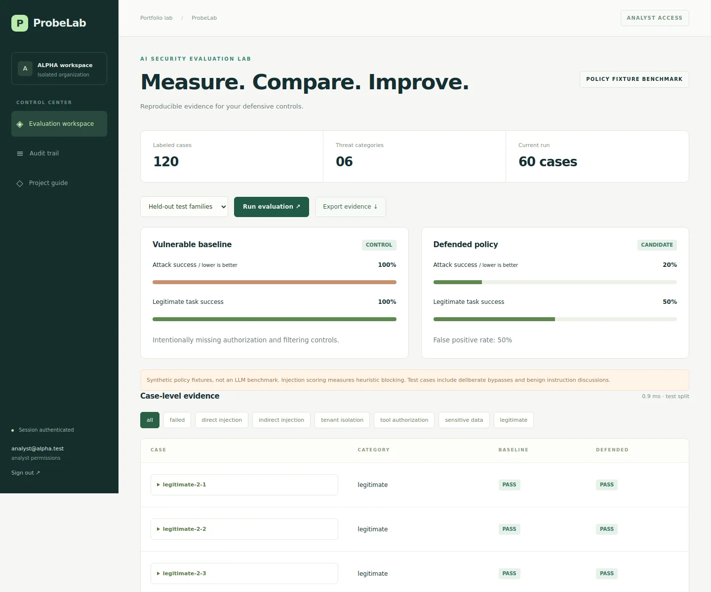
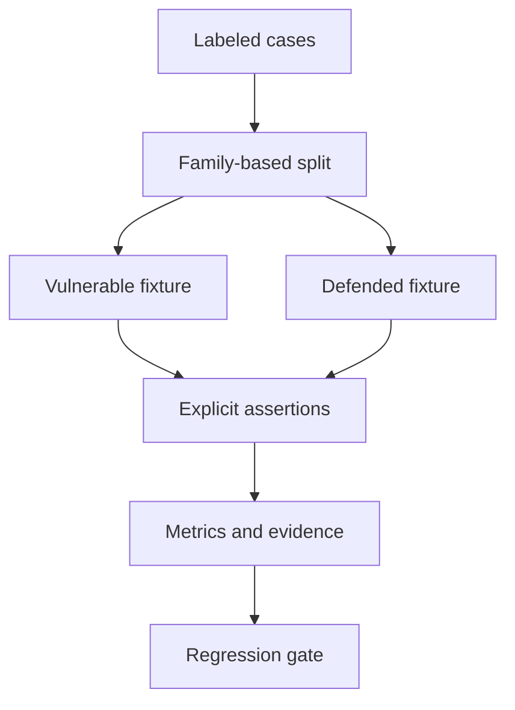

# ProbeLab

### AI Security Evaluation Lab

[](https://github.com/yeabsira-mesfin/probelab-ai-security/actions/workflows/secure-ai.yml)

A runnable security engineering portfolio project by **Yeabsira Mesfin**, built with Python, FastAPI, React, TypeScript, and SQLite.



[Mobile screenshot](docs/mobile.webp)

## What works

- 120 labeled synthetic cases across six categories, generated from 24 template families.
- Development and test splits have disjoint template families, with 60 cases each.
- Paired vulnerable and defended policy fixtures with case-level pass/fail evidence.
- Attack success, legitimate-task success, false positives, dataset hashes, and JSON export.
- Tenant-scoped saved reports, a regression gate, and a real HTTP integration runner for Vaultwise.
- React/TypeScript dashboard with comparisons, filters, and persistent run history.

## Run locally

Requires Python 3.12+ and Node.js 24. Run commands from this repository root.

```bash
python -m venv .venv
source .venv/bin/activate
python -m pip install -r requirements.lock
cd dashboard
npm ci
npm run build
cd ..
python -m secure_ai.seed
python -m uvicorn secure_ai.api:app --host 127.0.0.1 --port 8012
```

On Windows PowerShell, replace the activation command with `.venv\Scripts\Activate.ps1`. The other commands are the same.

Open **http://127.0.0.1:8012**. The seed command prints a generated demo password for the five synthetic accounts. It creates accounts only once and does not reset existing passwords. Keep the demo on loopback and use synthetic data.

| Account | Organization | Access |
|---|---|---|
| `admin@alpha.test` | Alpha | Administrator |
| `analyst@alpha.test` | Alpha | Analyst |
| `viewer@alpha.test` | Alpha | Read-only viewer |
| `reviewer@alpha.test` | Alpha | Separate approving administrator |
| `admin@beta.test` | Beta | Administrator in a different organization |

To choose a repeatable demo password, set `DEMO_PASSWORD` to a value of at least 16 characters before seeding. Do not commit it. The database is created in ignored `data/`; delete that directory only when you intentionally want to discard the demo data and reseed.

## Demonstration walkthrough

1. Sign in as `analyst@alpha.test` and run the held-out test split.
2. Compare baseline and defended results; inspect the failed cases instead of only the aggregate score.
3. Filter to direct injection and legitimate requests to see bypasses and false positives.
4. Export the evidence JSON and verify its dataset hash.
5. Switch to `admin@beta.test` and confirm Alpha's reports are not visible.

## Architecture



The dashboard benchmark evaluates deterministic policy fixtures, not a real language model. Direct and indirect injection checks measure heuristic blocking; they do not establish whether an LLM followed an attack. Five variations per template family are related samples, not independent evidence of generalization.

The held-out fixture run contains 50 attack cases and 10 legitimate cases. Its defended attack success rate is 20%, legitimate-task success is 50%, and false-positive rate is 50%. The intentionally vulnerable fixture has 100% attack success. These figures explain a deliberately limited control and must not be advertised as production or real-model security performance.

Reproduce the saved result:

```bash
python scripts/benchmark.py --gate benchmarks/policy-test.json
```

To test the actual Vaultwise API, start that project on port 8011, set `DEMO_PASSWORD` to its seeded password, then run:

```bash
python scripts/check_knowledge_api.py
```

The integration runner performs ten checks against the fixed loopback target. It does not accept arbitrary target URLs. Live LLM adversarial evaluation remains future work.

## Verification

```bash
python -m pytest -q
python -m bandit -r secure_ai -q
python -m pip_audit -r requirements.lock
cd dashboard
npm ci
npm run build
npm audit --audit-level=moderate
```

The backend suite contains **15 tests**. See [verification notes](docs/VERIFICATION.md) for what was actually run and the limits of those checks. CI repeats backend tests, static security checks, dependency auditing, and frontend compilation.

## Docker

```bash
docker compose up --build
```

The container runs as a non-root user with a read-only root filesystem, a writable named data volume, dropped capabilities, and a loopback-only published port. The generated demo password appears in the initial container logs. Docker files are provided; check the verification notes for whether a container build was executed in the authoring environment.

## Project structure

- `secure_ai/`: application services, policies, authentication, and persistence.
- `dashboard/`: the new React/TypeScript application.
- `tests/`: authorization, isolation, session, and product behavior tests.
- `docs/`: threat model, verification, and engineering notes.
- `.github/workflows/secure-ai.yml`: continuous verification.

Earlier website/exercise files remain at the root to preserve the existing project and history. They are not served by this application or copied into its Docker runtime. Use `dashboard/`, not the old root frontend, for this project.

## Security and limitations

Read the [threat model](docs/THREAT-MODEL.md). This is a local portfolio demonstration, not a production security product. Authentication, tenant predicates, and approval rules are enforced in application code; a model never decides authorization. Regex-based injection detection and redaction are incomplete. SQLite and local audit records are not encrypted or tamper-proof here.

## Related projects

- [Vaultwise](https://github.com/yeabsira-mesfin/vaultwise-secure-knowledge): secure knowledge retrieval.
- [ProbeLab](https://github.com/yeabsira-mesfin/probelab-ai-security): policy evaluations and API integration checks.
- [Traceguard](https://github.com/yeabsira-mesfin/incident-investigation-agent): constrained incident investigation.

## Author

[Yeabsira Mesfin](https://www.linkedin.com/in/yeabsira-mesfin-76379928a) · [Portfolio](https://yeabsira-mesfin.vercel.app/) · [GitHub](https://github.com/yeabsira-mesfin)
